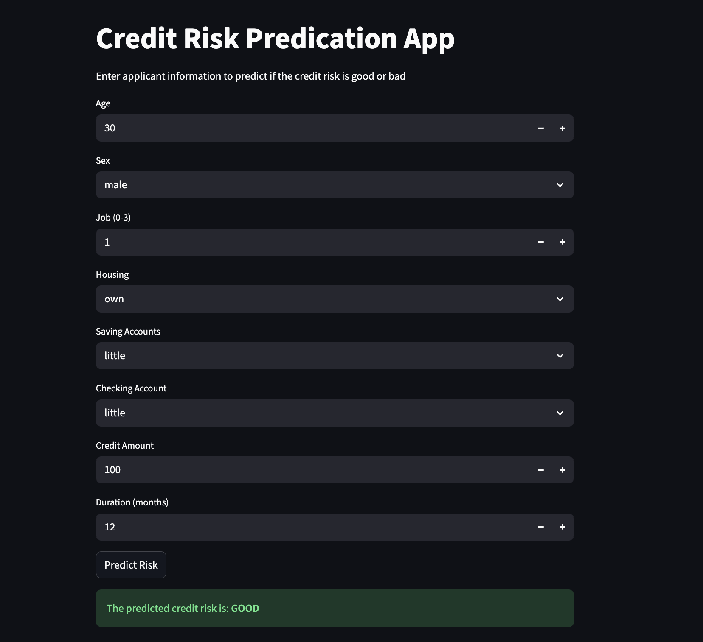

# 💳 Credit Risk Modeling Using Machine Learning

## 📌 Project Overview

In this project, we build a **Credit Risk Modeling system** using **Python and Machine Learning** from scratch. The goal is to predict whether a loan applicant is a **good or bad credit risk** based on their financial and demographic information.

This project demonstrates a **complete end-to-end data science workflow**, covering data preprocessing, feature encoding, model training, evaluation, and deployment using **Streamlit**.

It is designed to help:

* 🚀 Beginners understand real-world ML workflows
* 🎯 Students prepare for **data science & ML interviews**
* 🧠 Learners practice **credit risk analysis** used in the finance industry

---

## 🚀 Live Dashboard

👉 **Streamlit App:**
🔗 [https://credit-risk-modeling-using-ml.streamlit.app/](https://credit-risk-modeling-using-ml.streamlit.app/)

---

## 📊 Dashboard Preview



---

## 🧠 Key Features

* Real-world **financial credit dataset**
* Data cleaning & preprocessing
* Handling **categorical variables** using encoders
* Training an **Extra Trees Classifier**
* Credit risk prediction: **Good / Bad**
* Interactive **Streamlit web app**
* End-to-end ML project (Model → App → Deployment)

---

## 🛠️ Tech Stack

* **Programming Language:** Python
* **Libraries:**

  * Pandas
  * NumPy
  * Scikit-learn
  * Joblib
  * Streamlit
* **Model Used:** Extra Trees Classifier
* **Deployment:** Streamlit Cloud

---

## 📂 Project Structure

```
Credit-Risk-Modeling-Using-ML/
│
├── app.py                         # Streamlit application
├── extra_tree_credit_model.pkl    # Trained ML model
├── Sex_encoder.pkl
├── Housing_encoder.pkl
├── Saving accounts_encoder.pkl
├── Checking account_encoder.pkl
├── credit_dashboard.png           # Dashboard image
├── requirements.txt               # Project dependencies
├── runtime.txt                    # Python version for deployment
└── README.md                      # Project documentation
```

---

## ⚙️ How It Works

1. User enters applicant details (age, job, housing, accounts, etc.)
2. Inputs are encoded using saved encoders
3. The trained ML model predicts credit risk
4. Result is displayed as:

   * ✅ **GOOD credit risk**
   * ❌ **BAD credit risk**

---

## 🧪 Model Training Highlights

* Feature engineering and encoding
* Handling categorical variables
* Tree-based ensemble model
* Robust performance on unseen data
* Saved using `joblib` for deployment

---

## 📦 Installation (Local Setup)

```bash
git clone https://github.com/Dharmendra-07/Credit-Risk-Modeling-Using-ML.git
cd credit-risk-modeling-using-ml
pip install -r requirements.txt
streamlit run app.py
```

---

## 🎯 Learning Outcomes

By completing this project, you will learn:

* How credit risk models work in finance
* How to preprocess real-world datasets
* How to use Scikit-learn for classification
* How to deploy ML models using Streamlit
* How to build portfolio-ready data science projects

---

## 🧑‍💻 Author

**Dharmendra Kumar**
Data Science & Machine Learning Enthusiast
📍 IIT Madras

---

## ⭐ If you like this project

Give it a ⭐ on GitHub — it really helps and motivates me to build more projects like this!
